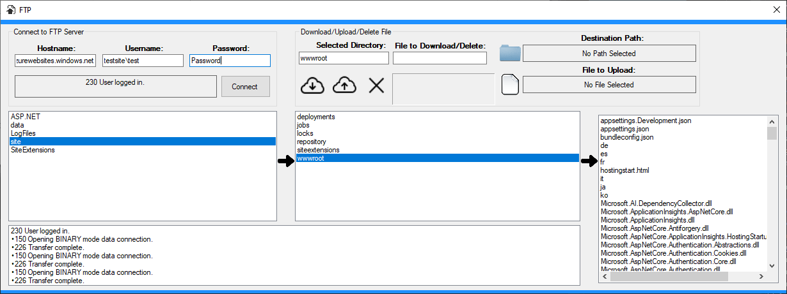
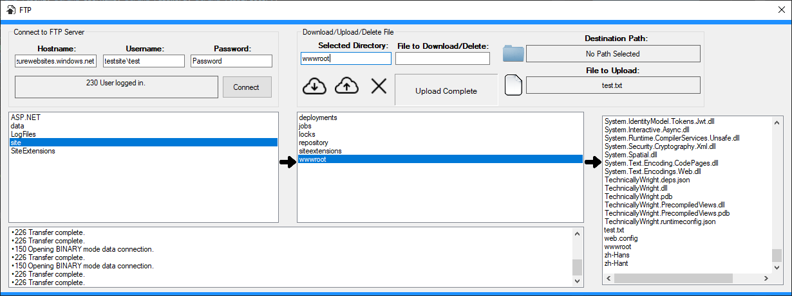

# FtpConnect - Windows Forms

A basic ftp application made with C# and Windows forms that connects to a ftp host and includes simple operations such as read contents 
in a directory, upload a file, delete a file, or download a file. 

Made as part of a final project in *Fall 2016* for an introduction to desktop app development class. 

  * **NOTE:** Since this application was made for an intro class, it's recommended to run on a test ftp server.
  * Because of simplicity directories only span the few list boxes
  
Other projects created for the final include:

* Simple login program using a SQL local database with Visual Studio. This solution contains each one of the other 3 projects created for the final as a separate form once the user logs in.  
***Link to source***: https://github.com/hjohnson12/LoginPanel 
* Simple implementation of a file watcher program that watched a source directory for changes and published the 
changes to the destination directory. 
***Link to source***: https://github.com/hjohnson12/FileSync
* Text Editor application written in C# and Windows Forms. 
***Link to source***: https://github.com/hjohnson12/TextEditor 

 ***Not currently being worked on***
   * May update the repositories to include Windows 10 Universal Windows Platform controls once Xaml Islands fully releases

### Screenshots

##### Logged into ftp server. Listbox on the far left is the root directory:

* Server status is at the bottom of the application and returns messages sent from the server

##### Able to delete a file from the server:

* ***hostingstart.html*** is the current file to be downloaded, and download path is set to E: drive.
* The status label "Download Successful" gives the status on updates done with Download, Upload, and Delete.

##### Ability to upload a file to a directory:

* *test.txt* was uploaded successfully, which is shown inside the *wwwroot* directory

* Make sure directory name is in the textbox and the file to be uploaded is selected

### Prerequisites

Requires *Visual Studio 2017 or higher* to run the application.

To be able to test the operations it requires a FTP Hostname, Username, and Password. 

  * *Example*: Ftp hostname: *ftp.example.com*, Username: *myloginname*, Password: *password*

## Built With

* C# Windows Forms and .NET classes

## Contributing

[Coming Soon]

## Authors

* **Hunter** - *Initial work* - [hjohnson012](https://github.com/hjohnson012)

See also the list of [contributors](https://github.com/hjohnson12/KanbanBoardUWP/graphs/contributors) who participated in this project.

## License

This project is licensed under the MIT License - see the [LICENSE.md](LICENSE.md) file for details
